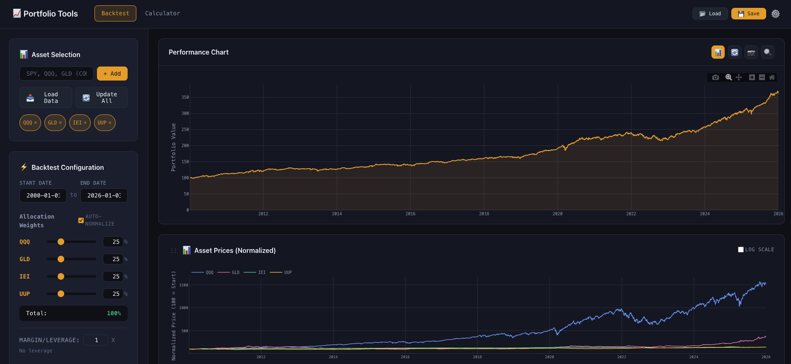

# PortfolioExpert

A lightweight yet powerful portfolio research tool for investors who want to study portfolio performance, run backtests, and calculate real-time position sizing with risk analysis.

<!-- Replace with your own screenshot: save as docs/screenshot.png -->


*Backtest your portfolio allocations with interactive charts and comprehensive metrics*

## Why PortfolioExpert?

Whether you're building a long-term investment strategy or rebalancing your current portfolio, PortfolioExpert helps you:

- **Study historical performance** — See how your portfolio allocation would have performed over any time period
- **Make informed decisions** — Understand risk metrics like Sharpe ratio, max drawdown, and volatility before committing capital
- **Calculate exact positions** — Know precisely how many shares to buy/sell to achieve your target allocation
- **Analyze risk exposure** — View Value-at-Risk (VaR) projections and Monte Carlo simulations

All running locally on your machine with automatic data caching — no subscription fees, no data limits.

## Features

### 📊 Backtest Tool

| Feature | Description |
|---------|-------------|
| **Any Ticker** | Add stocks, ETFs, indices, or bonds from Yahoo Finance |
| **Auto Data Sync** | Automatic data fetching and smart caching (no redundant API calls) |
| **Custom Allocations** | Set precise portfolio weights with auto-normalization |
| **Leverage Support** | Test leveraged strategies with realistic borrowing costs |
| **Sub-Period Analysis** | Change allocations mid-backtest to simulate rebalancing |
| **Rich Metrics** | Total return, CAGR, Sharpe ratio, volatility, max drawdown |
| **Interactive Charts** | Zoom, pan, and export Plotly.js visualizations |
| **Save Strategies** | Store and reload your portfolio configurations |

### 🧮 Calculator Tool

| Feature | Description |
|---------|-------------|
| **Position Sizing** | Calculate exact share counts for your target allocation |
| **Current Holdings** | Input existing positions to get buy/sell orders |
| **Risk Metrics** | Expected return, volatility, Sharpe ratio |
| **VaR Analysis** | 95% and 99% Value-at-Risk over 30 days |
| **Projections** | Monte Carlo simulations for portfolio value forecasts |

## Quick Start

### 1. Start the Backend

```bash
cd backend

# Create virtual environment (first time only)
python3 -m venv venv

# Activate virtual environment
source venv/bin/activate  # macOS/Linux
# venv\Scripts\activate   # Windows

# Install dependencies (first time only)
pip install -r requirements.txt

# Start the server
python main.py
```

Or simply run the convenience script from the project root:
```bash
./start.sh
```

### 2. Open the App

Open `app/index.html` in your browser:

```bash
# macOS
open app/index.html

# Or just double-click the file in Finder/Explorer
```

### 3. Run Your First Backtest

1. **Add tickers** — Type `SPY, QQQ, BND` and click "Add"
2. **Adjust weights** — Use sliders to set your allocation
3. **Set date range** — Choose your analysis period
4. **Click "Run Backtest"** — View results instantly

## Project Structure

```
PortfolioExpert/
├── app/                        # Frontend application
│   ├── index.html              # Backtest tool
│   ├── calculator.html         # Position calculator
│   ├── css/                    # Stylesheets
│   └── js/                     # Application logic
│
├── backend/                    # Python API server
│   ├── main.py                 # FastAPI entry point
│   ├── config.py               # Configuration
│   ├── requirements.txt        # Dependencies
│   ├── database/               # SQLite models & schema
│   ├── modules/                # Core logic
│   │   ├── data_loader.py      # Auto data fetching & caching
│   │   ├── backtest_engine.py  # Backtesting calculations
│   │   └── portfolio.py        # Portfolio management
│   └── routers/                # API endpoints
│
├── docs/                       # Documentation assets
│   └── screenshot.png          # UI screenshot for README
├── start.sh                    # One-command startup
├── .gitignore
└── README.md
```

## API Reference

| Method | Endpoint | Description |
|--------|----------|-------------|
| GET | `/data/tickers` | List all cached tickers |
| POST | `/data/load` | Fetch and cache ticker data |
| POST | `/data/update` | Update ticker to latest prices |
| POST | `/backtest` | Run portfolio backtest |
| POST | `/backtest/subperiod` | Backtest with allocation changes |
| GET | `/portfolios` | List saved strategies |
| POST | `/portfolios` | Save a strategy |

Interactive API docs at `http://localhost:8000/docs` when running.

## Configuration

### FRED API Key (Optional)

For Federal Funds Rate data (used in Sharpe ratio and leverage cost calculations):

```bash
export FRED_API_KEY="your_api_key_here"
```

Or create `backend/.env`:
```
FRED_API_KEY=your_api_key_here
```

Get a free key at: https://fred.stlouisfed.org/docs/api/api_key.html

## Tech Stack

| Layer | Technology |
|-------|------------|
| Frontend | Vanilla HTML/CSS/JS, Plotly.js, Flatpickr |
| Backend | Python 3.9+, FastAPI, SQLAlchemy |
| Database | SQLite (local, zero-config) |
| Data | Yahoo Finance, FRED (optional) |

## License

MIT
